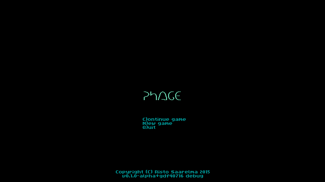
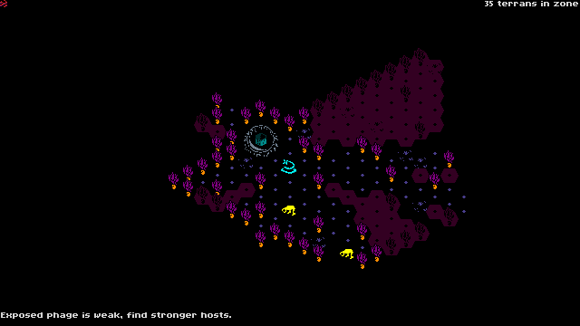
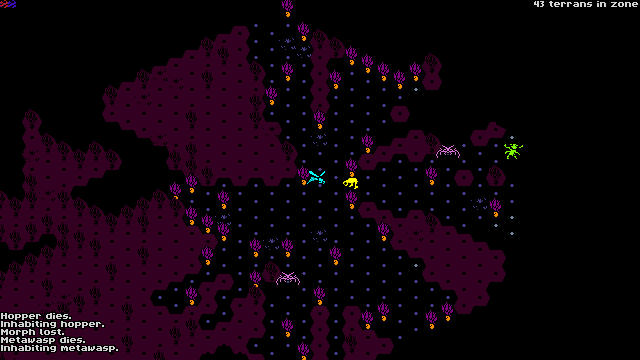
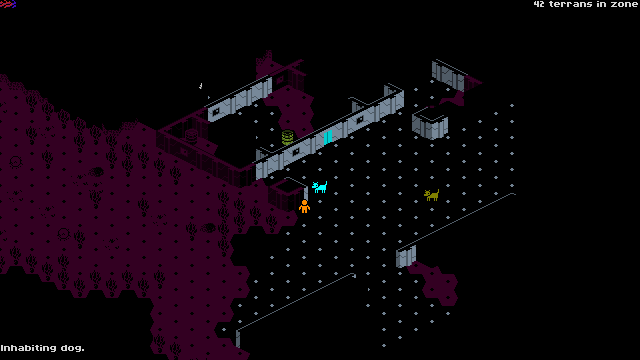
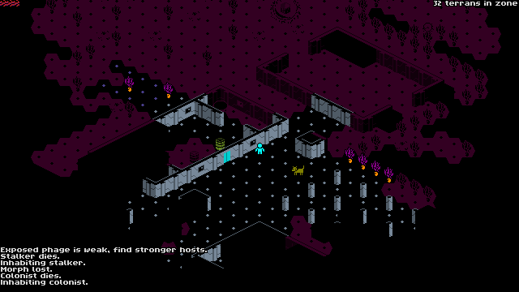

PHAGE -- 2015 7DRL roguelike

Build instructions
------------------

As of 2015-03-14, Rust is still under constant development, and
working combinations of a Rust compiler version and library
dependencies tend to go out of order every few days. The current
working set of third-party libraries is described in the Cargo.lock
file, and the Rust compiler version used to successfully build the
target is saved in rustc\_version.txt.

To build Phage on your own, install Rust from the archive folder in
rust-lang.org with the same date as the built-date in
rustc\_version.txt, eg.
http://static.rust-lang.org/dist/2015-03-12/index.html

If you're on Windows, you will also need to have MinGW GCC installed
and in your command line path to be able to build the third-party
dependencies.

With the correct rustc version in your path, just go to the Phage
directory and type

    cargo run

for a faster-compiling debug build or

    cargo run --release

for the release build.

Screenshots
-----------

