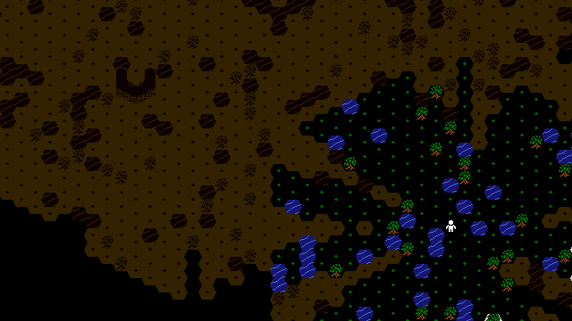
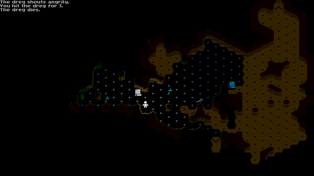
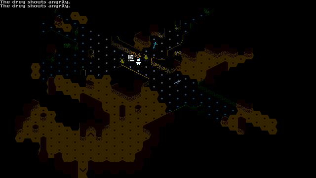

A fantasy deathcrawl in Rust

Work in progress.

To run, with Rust compiler and Cargo package manager installed:

$ cargo run --release

When building on Windows, you may need to have MinGW gcc installed
and in PATH for cargo to be able to build all the necessary
dependencies.

Screenshots
-----------

From October 2017

